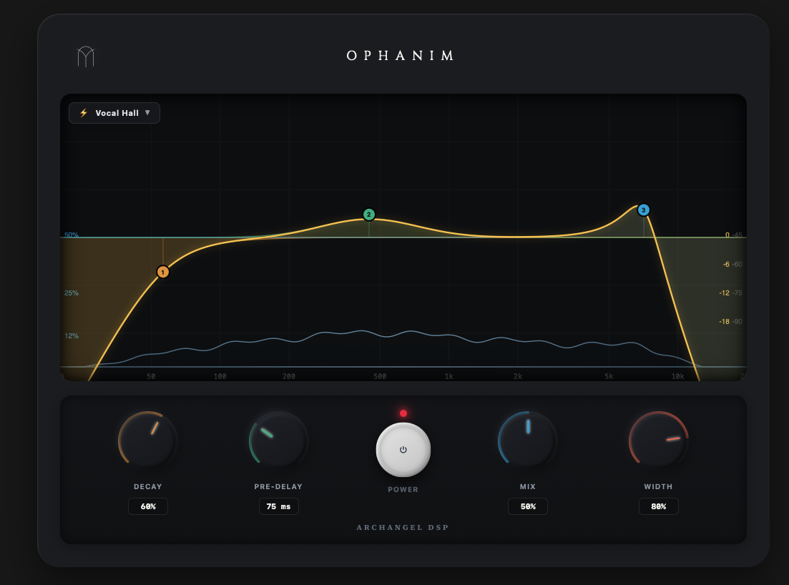

<p align="center">
  
</p>

<h1 align="center">Ophanim</h1>

<p align="center">
  <b>Modern Resonant Reverb & Parametric EQ Audio Plugin</b><br>
  Developed by <b>Archangel DSP</b>
</p>

---

## 🌟 Overview

**Ophanim** is a high-performance audio reverb plugin designed by **Archangel DSP**. It combines a real-time visual spectrum analyzer with interactive resonant filters and a rich reverb processing engine.

---

## ✨ Features

- 🎛️ **Interactive Parametric EQ Graph**: Double-click to create nodes, drag to adjust frequency & gain, mouse wheel to tweak Q / slope steepness.
- 🌊 **FabFilter-Style Resonant Filters**: Real-time Low Cut, High Cut, Bell, Low Shelf, and High Shelf filters with natural resonance behavior.
- ⚡ **Real-Time Spectrum Analyzer**: Multi-band FFT analyzer visualization.
- 🎚️ **Reverb Engine Controls**: Comprehensive controls for Decay, Pre-Delay, Mix, and Stereo Width.
- 🎨 **Sleek Hardware Interface**: Dark-mode UI styled with glowing LED meters and custom controls.
- 🔌 **VST3 Format**: Built using JUCE C++ backend and a high-performance React web frontend.

---

## 🛠️ Building from Source

### System Requirements
- **OS**: macOS 10.15 (Catalina) or later
- **Toolchain**: Xcode / Clang, CMake (v3.15+)
- **Environment**: Node.js (v18+) & npm / pnpm

### Quick Start Build Guide

1. **Clone the Repository**:
   ```bash
   git clone https://github.com/jfachriz/Ophanim.git
   cd Ophanim
   ```

2. **Install Frontend Dependencies**:
   ```bash
   npm install
   ```

3. **Build Frontend & Deploy VST3 Plugin**:
   ```bash
   bash copy_web_resources.sh
   ```
   *(This builds the production React application and automatically deploys `Ophanim.vst3` to `~/Library/Audio/Plug-Ins/VST3/Ophanim.vst3`)*

4. **Compile macOS Installer Package (.dmg)**:
   ```bash
   bash build_installer.sh
   ```
   *(Generates `Ophanim-v1.0.0.dmg` inside the `Installer/` directory)*

---

## 📦 File Format & System Installation

| Format | Output File | Install Location |
| :--- | :--- | :--- |
| **VST3 Plugin** | `Ophanim.vst3` | `~/Library/Audio/Plug-Ins/VST3/Ophanim.vst3` |
| **macOS Installer** | `Ophanim-v1.0.0.dmg` | `Installer/Ophanim-v1.0.0.dmg` |

---

## 📜 License

© 2026 **Archangel DSP**. All rights reserved.
